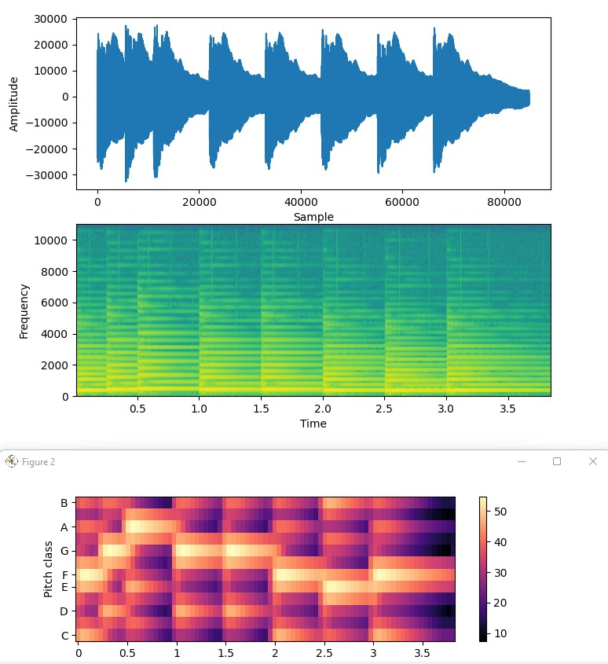

# Chromaplot

A simple script that plots amplitude, spectrograms and chromagrams for a given mono wav audio file. 



## Setup 

Use the latest Python. Tested with Python 3.10.4.
```bash
py -m pip install librosa scipy matplotlib ipython numpy # Windows
```
To run:
```
py chromaprint.py 
```


## References

Super simple guide on plotting spectrogram
https://pythontic.com/visualization/signals/spectrogram

https://www.audiolabs-erlangen.de/resources/MIR/FMP/B/B_PythonVisualization.html

https://www.audiolabs-erlangen.de/resources/MIR/FMP/C3/C3S1_SpecLogFreq-Chromagram.html